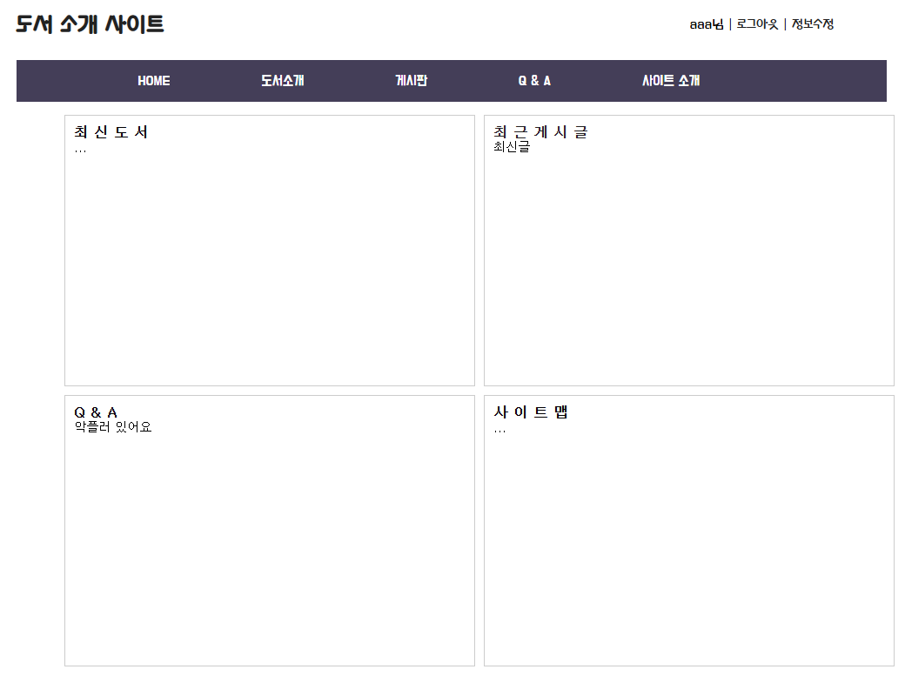
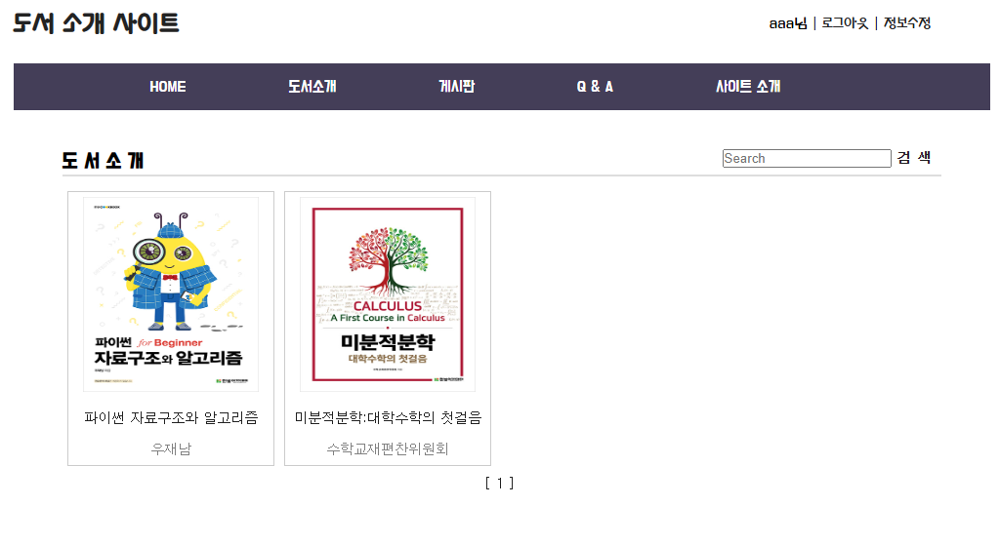
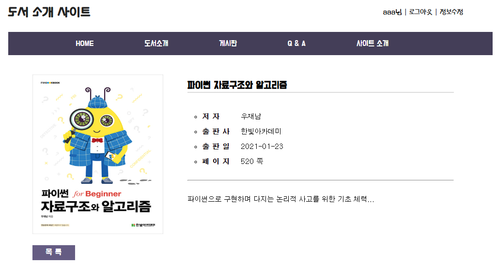
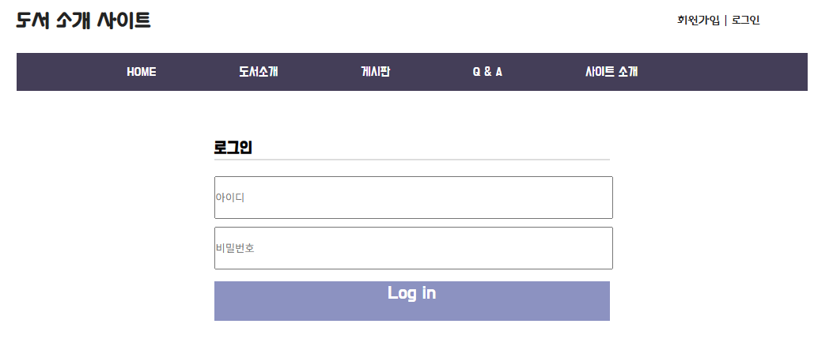
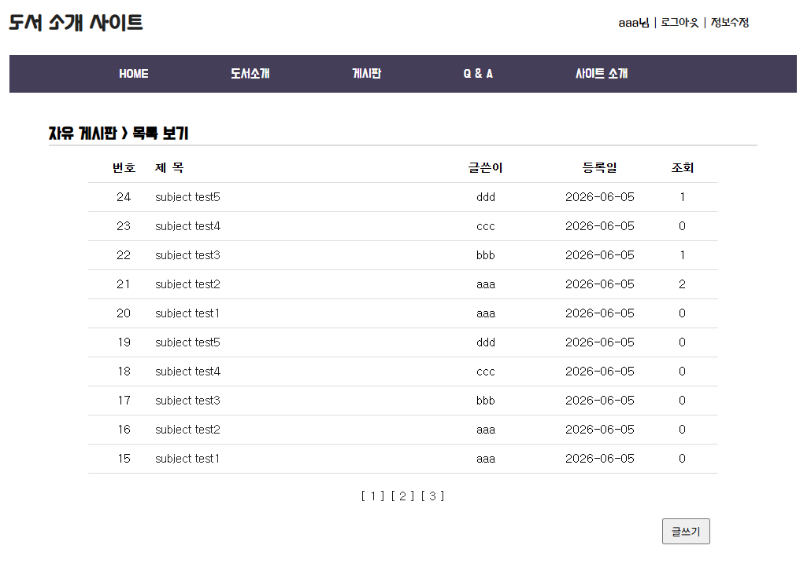
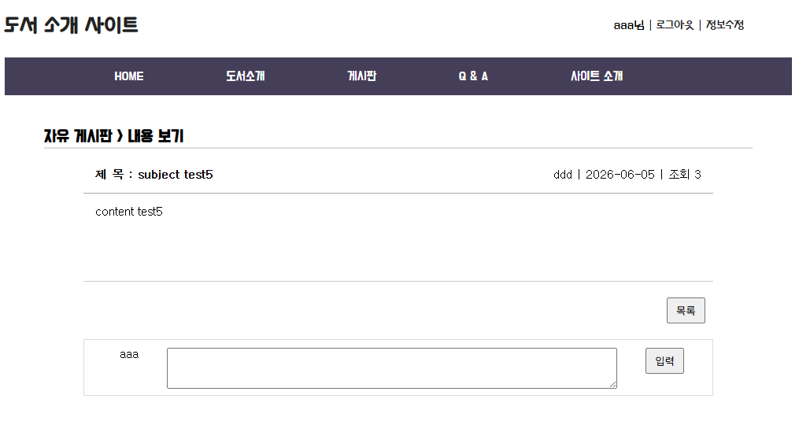
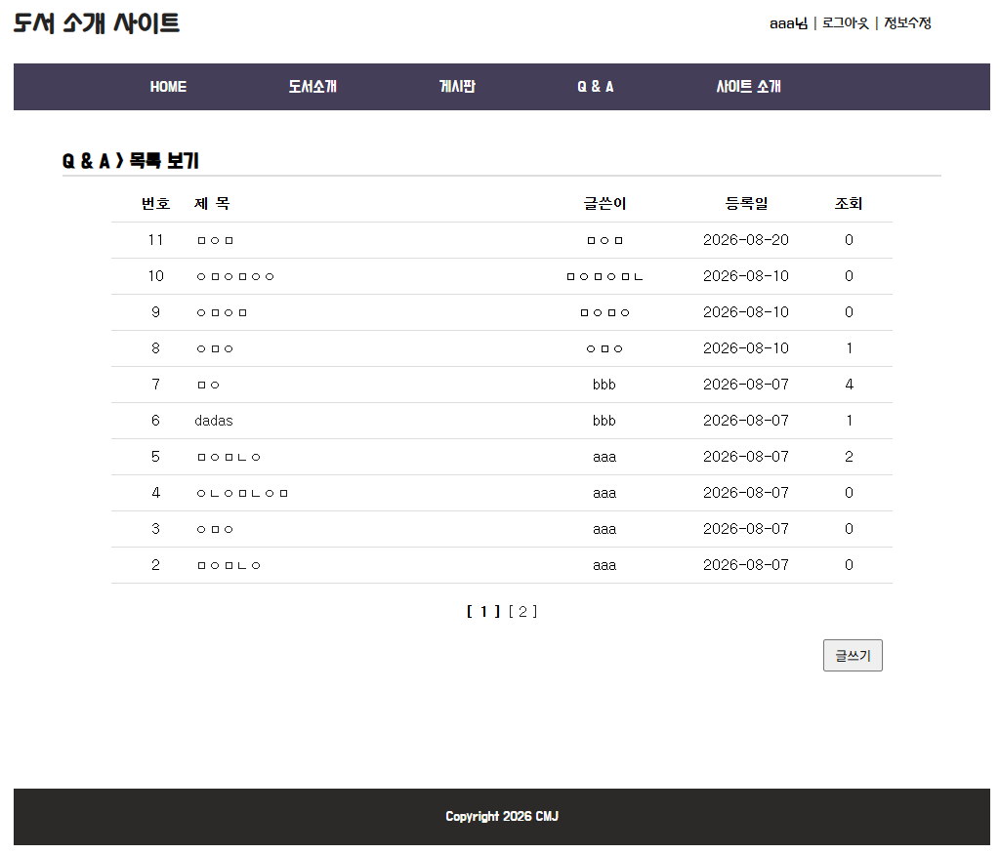
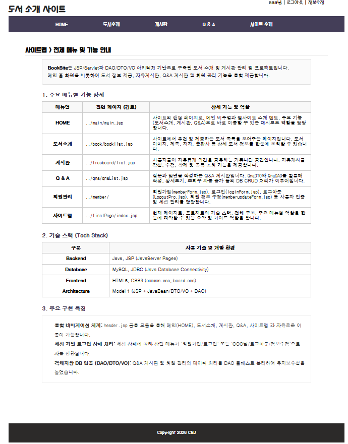

# 📚 BookSite

## JSP · JDBC · MySQL 기반 도서 정보 및 커뮤니티 웹 서비스

> **도서 정보 조회와 회원·자유게시판·댓글·Q&A 기능을 통합한 JSP 기반 웹 애플리케이션**
>
> JSP에서 화면을 구성하고 DAO/VO·DTO를 통해 비즈니스 데이터와 DB 접근 로직을 분리하여
> **회원 → 도서 조회 → 게시글 작성 → 댓글 → Q&A**로 이어지는 웹 서비스의 기본 구조를 구현했습니다.

---

# 📌 프로젝트 소개

BookSite는 **도서 정보를 제공하면서 사용자 간 커뮤니티 기능을 함께 사용할 수 있도록 개발한 JSP 기반 웹 프로젝트**입니다.

단순 정적 도서 소개 페이지에서 발전시켜 MySQL 데이터베이스를 연동하고,

* 회원가입 / 로그인
* 도서 목록 및 상세 조회
* 도서 검색
* 자유게시판
* 게시글 댓글
* Q&A 게시판
* Q&A 답변
* Q&A 댓글
* 게시글 수정 / 삭제
* 페이징

등의 기능을 하나의 웹사이트에 통합했습니다.

프로젝트를 통해 JSP에서 요청 데이터를 처리하고 DAO를 통해 MySQL 데이터를 조회·수정한 뒤 다시 화면에 출력되는 **웹 애플리케이션의 전체 데이터 흐름**을 학습하고 구현하는 것을 목표로 했습니다.

---

# 🎯 개발 목표

```text
사용자
  ↓
JSP 화면
  ↓
DAO
  ↓
JDBC / JNDI DataSource
  ↓
MySQL
  ↓
조회 결과
  ↓
JSP 화면 출력
```

다음 내용을 직접 적용하는 것을 목표로 개발했습니다.

* JSP 기반 동적 웹 페이지 구현
* Session 기반 로그인 상태 관리
* MySQL 데이터베이스 설계 및 연동
* JDBC CRUD
* DAO / VO · DTO 구조
* PreparedStatement
* Connection Pool
* 게시판 Pagination
* 게시글과 댓글의 관계 처리
* Q&A 계층형 답변 구조

---

# 🛠 Tech Stack

| 구분              | 기술                                |
| --------------- | --------------------------------- |
| Language        | Java 21                           |
| Back-End        | JSP                               |
| Front-End       | HTML5, CSS3, JavaScript           |
| Database        | MySQL                             |
| Database API    | JDBC                              |
| DB Connection   | JNDI DataSource / Connection Pool |
| Server          | Apache Tomcat 9                   |
| Architecture    | JSP + DAO + VO/DTO                |
| IDE             | Eclipse                           |
| Version Control | Git / GitHub                      |

---

# 🏗 Architecture

```text
┌────────────────────────────┐
│          Browser           │
└─────────────┬──────────────┘
              │ HTTP Request
              ▼
┌────────────────────────────┐
│            JSP             │
│ 화면 / 요청 / Session 처리 │
└─────────────┬──────────────┘
              │
              ▼
┌────────────────────────────┐
│          DAO Layer         │
│                            │
│ BookDAO                    │
│ MemberDAO                  │
│ FreeboardDAO               │
│ ReplyfreeboardDAO          │
│ QnaDAO                     │
└─────────────┬──────────────┘
              │ JDBC
              ▼
┌────────────────────────────┐
│       JNDI DataSource      │
│        jdbc/basicjsp       │
└─────────────┬──────────────┘
              │
              ▼
┌────────────────────────────┐
│           MySQL            │
└────────────────────────────┘
```

---

# ✨ 주요 기능

## 1. 👤 회원 관리

사용자가 계정을 생성하고 로그인한 상태에서 게시판 기능을 사용할 수 있도록 회원 기능을 구현했습니다.

### 주요 기능

* 회원가입
* ID 중복 확인
* 로그인
* 로그아웃
* Session 기반 로그인 상태 유지
* 회원정보 수정 화면

회원가입 시 입력받은 정보를 `member` 테이블에 저장하며 로그인 시 사용자가 입력한 ID를 DB에서 조회하여 비밀번호를 확인합니다.

```text
로그인 요청
   ↓
ID 조회
   ↓
사용자 존재 여부 확인
   ↓
비밀번호 비교
   ↓
Session 생성
```

---

# 2. 📖 도서 목록 및 상세 조회

MySQL의 `book` 테이블에 저장된 도서 정보를 웹에서 조회할 수 있도록 구현했습니다.

관리 정보

* 도서번호
* 도서 분류
* 도서명
* 저자
* 출판사
* 출판일
* 페이지 수
* 표지 이미지
* 도서 소개

### 주요 기능

* 전체 도서 목록
* 도서 상세 조회
* 제목 검색
* Pagination
* 도서 이미지 출력

---

## 도서 검색

사용자가 검색어를 입력하면 도서 제목을 기준으로 조회합니다.

```sql
SELECT *
FROM book
WHERE btitle LIKE ?
ORDER BY bnum DESC
LIMIT ?, ?
```

검색 기능에서도 전체 목록과 동일하게 Pagination을 적용할 수 있도록 구성했습니다.

---

# 3. 💬 자유게시판

회원들이 자유롭게 게시글을 작성하고 내용을 공유할 수 있도록 자유게시판을 구현했습니다.

### 주요 기능

* 게시글 목록
* 게시글 작성
* 게시글 상세 조회
* 게시글 삭제
* 조회수 증가
* Pagination
* 댓글 작성
* 댓글 조회
* 댓글 삭제

---

## 게시글 조회수 처리

사용자가 게시글 상세 페이지를 열면 해당 게시글의 조회수를 증가시키도록 구현했습니다.

```text
게시글 선택
   ↓
readcount + 1
   ↓
게시글 상세 데이터 조회
   ↓
화면 출력
```

---

## 게시판 Pagination

전체 데이터를 한 화면에 출력하지 않고 MySQL의 `LIMIT`을 이용하여 필요한 범위의 게시글만 가져오도록 구현했습니다.

```sql
SELECT *
FROM freeboard
ORDER BY num DESC
LIMIT ?, ?
```

이를 통해 게시글 수가 증가하더라도 페이지 단위로 데이터를 조회할 수 있습니다.

---

# 4. 💭 자유게시판 댓글

자유게시판의 게시글과 댓글을 별도의 테이블로 분리했습니다.

```text
FREEBOARD
    │
    │ num
    ▼
REPLYFREEBOARD
      ref
```

댓글 테이블의 `ref` 값으로 원본 게시글 번호를 저장하여 하나의 게시글에 여러 댓글이 연결되도록 구현했습니다.

### 댓글 정보

* 댓글 번호
* 작성자
* 내용
* 작성일
* 원본 게시글 번호

---

## 게시글 삭제 시 댓글 처리

게시글을 삭제할 때 해당 게시글에 연결된 댓글을 먼저 삭제한 후 원본 게시글을 삭제하도록 처리했습니다.

```text
게시글 삭제
    ↓
연결된 댓글 삭제
    ↓
원본 게시글 삭제
```

이를 통해 삭제된 게시글의 댓글 데이터가 남는 문제를 방지했습니다.

---

# 5. ❓ Q&A 게시판

사용자가 질문을 등록하고 질문에 답변 및 댓글을 작성할 수 있는 Q&A 게시판을 구현했습니다.

### 주요 기능

* 질문 목록
* 질문 작성
* 질문 상세 조회
* 질문 수정
* 질문 삭제
* 조회수 증가
* 답변글 작성
* 계층형 답변 표시
* 댓글 작성
* 댓글 조회
* 댓글 삭제
* Pagination
* 비밀글 여부 저장

---

# 🌳 Q&A 계층형 답변 구조

단순 댓글과 별도로 **게시글에 대한 답변을 또 하나의 게시글 형태로 관리**할 수 있도록 구현했습니다.

다음 세 값을 사용하여 원글과 답변의 관계를 표현했습니다.

| Column     | 역할           |
| ---------- | ------------ |
| `ref`      | 같은 질문 그룹을 구분 |
| `re_step`  | 그룹 내부 출력 순서  |
| `re_level` | 답변 깊이        |

예를 들어,

```text
질문
 ├─ 답변 1
 │    └─ 답변 1-1
 └─ 답변 2
```

와 같은 계층 구조를 데이터로 표현할 수 있도록 구성했습니다.

답변글을 등록할 경우 기존 답변의 `re_step`을 조정하여 출력 순서가 유지되도록 처리했습니다.

---

# 6. 🔒 Q&A 비밀글 데이터

Q&A 게시글에는 `secret` 값을 추가하여 일반 게시글과 비밀 게시글을 구분할 수 있도록 데이터 구조를 설계했습니다.

```text
secret = N → 일반글
secret = Y → 비밀글
```

비밀글 여부를 게시글 데이터와 함께 저장하여 이후 접근 권한 기능으로 확장할 수 있도록 구성했습니다.

---

# 7. 💬 Q&A 댓글

계층형 답변 기능과 별도로 게시글에 간단한 의견을 남길 수 있는 댓글 기능도 구현했습니다.

```text
QNA
 │
 │ num
 ▼
QNA_COMMENT
```

지원 기능

* 댓글 등록
* 게시글별 댓글 목록 조회
* 댓글 삭제
* 댓글 작성일 저장

---

# 🗄 Database

프로젝트에서 사용하는 주요 테이블입니다.

| Table            | 역할               |
| ---------------- | ---------------- |
| `member`         | 회원 정보            |
| `book`           | 도서 정보            |
| `freeboard`      | 자유게시판            |
| `replyfreeboard` | 자유게시판 댓글         |
| `qna`            | Q&A 게시글 및 계층형 답변 |
| `qna_comment`    | Q&A 댓글           |

---

## 데이터 관계

```text
MEMBER
  │
  ├──────────── FREEBOARD
  │                 │
  │                 ▼
  │          REPLYFREEBOARD
  │
  └──────────── QNA
                    │
                    ▼
               QNA_COMMENT


BOOK
 └── 독립적인 도서 정보 관리
```

`freeboard.writer`와 `replyfreeboard.rwriter`는 회원 ID를 기준으로 작성자를 관리하도록 설계했습니다.

---

# 💡 핵심 구현 내용

## 1. DAO Singleton Pattern

각 기능의 DAO 객체를 매 요청마다 새로 생성하지 않고 Singleton 형태로 사용할 수 있도록 구현했습니다.

```java
private static FreeboardDAO instance =
        new FreeboardDAO();

public static FreeboardDAO getInstance() {
    return instance;
}
```

다음 DAO에서 동일한 구조를 사용합니다.

```text
BookDAO
MemberDAO
FreeboardDAO
ReplyfreeboardDAO
QnaDAO
```

---

# 2. JNDI DataSource

DAO 내부에 DB URL과 계정 정보를 직접 작성하는 대신 Tomcat에서 제공하는 JNDI DataSource를 사용했습니다.

```java
InitialContext ic = new InitialContext();

DataSource ds =
    (DataSource) ic.lookup(
        "java:comp/env/jdbc/basicjsp"
    );

Connection conn = ds.getConnection();
```

이를 통해 JDBC Connection을 애플리케이션 코드와 분리하고 Connection Pool을 이용할 수 있도록 구성했습니다.

---

# 3. PreparedStatement

DB 작업 시 사용자 입력 데이터를 SQL 문자열에 직접 연결하지 않고 `PreparedStatement`의 Parameter로 전달했습니다.

```java
String sql =
    "INSERT INTO freeboard" +
    "(writer, subject, reg_date, content)" +
    " VALUES (?, ?, NOW(), ?)";

PreparedStatement pstmt =
    conn.prepareStatement(sql);

pstmt.setString(1, writer);
pstmt.setString(2, subject);
pstmt.setString(3, content);
```

---

# 4. DAO와 데이터 객체 분리

데이터베이스 접근과 데이터를 저장하는 객체의 역할을 분리했습니다.

```text
BookDAO       ↔ BookVO

MemberDAO     ↔ MemberVO

FreeboardDAO  ↔ FreeboardVO

ReplyfreeboardDAO
              ↔ ReplyfreeboardVO

QnaDAO        ↔ QnaDTO
              ↔ QnaCommentDTO
```

JSP 화면에서 직접 모든 SQL을 처리하는 대신 DAO를 통해 DB 작업을 수행하도록 구성했습니다.

---

# 5. Session 기반 로그인 처리

로그인 성공 시 사용자 ID를 Session에 저장하고 해당 정보를 이용하여 로그인 상태에 따라 화면과 게시판 기능을 다르게 처리할 수 있도록 구성했습니다.

```text
로그인
  ↓
MemberDAO.userCheck()
  ↓
인증 성공
  ↓
Session 저장
  ↓
로그인 사용자용 메뉴 출력
```

---

# 6. 게시판 Pagination

도서, 자유게시판, Q&A처럼 데이터가 계속 증가할 수 있는 페이지에 Pagination 구조를 적용했습니다.

```text
전체 게시글 수 조회
       ↓
현재 Page 계산
       ↓
startRow 계산
       ↓
LIMIT을 이용한 DB 조회
       ↓
페이지 번호 출력
```

전체 데이터를 한 번에 불러오지 않고 필요한 데이터만 조회하는 방식을 직접 적용했습니다.

---

# 📁 Project Structure

```text
BookSite/
│
├── src/main/
│   │
│   ├── java/
│   │   │
│   │   ├── book/
│   │   │   ├── BookDAO.java
│   │   │   └── BookVO.java
│   │   │
│   │   ├── member/
│   │   │   ├── MemberDAO.java
│   │   │   └── MemberVO.java
│   │   │
│   │   ├── freeboard/
│   │   │   ├── FreeboardDAO.java
│   │   │   └── FreeboardVO.java
│   │   │
│   │   ├── replyfreeboard/
│   │   │   ├── ReplyfreeboardDAO.java
│   │   │   └── ReplyfreeboardVO.java
│   │   │
│   │   └── qna/
│   │       ├── QnaDAO.java
│   │       ├── QnaDTO.java
│   │       └── QnaCommentDTO.java
│   │
│   ├── sql/
│   │   ├── book.sql
│   │   ├── member.sql
│   │   ├── freeboard.sql
│   │   ├── reply.sql
│   │   └── qna.sql
│   │
│   └── webapp/
│       │
│       ├── book/
│       │   ├── booklist.jsp
│       │   └── bookcontent.jsp
│       │
│       ├── member/
│       │   ├── memberForm.jsp
│       │   ├── memberCheckId.jsp
│       │   ├── loginForm.jsp
│       │   ├── loginPro.jsp
│       │   ├── LogoutPro.jsp
│       │   └── memberupdateForm.jsp
│       │
│       ├── freeboard/
│       │   ├── list.jsp
│       │   ├── content.jsp
│       │   ├── writeForm.jsp
│       │   ├── writePro.jsp
│       │   ├── replyWriterPro.jsp
│       │   └── deletePro.jsp
│       │
│       ├── qna/
│       │   ├── qnaList.jsp
│       │   ├── qnaDetail.jsp
│       │   ├── qnaWrite.jsp
│       │   ├── qnaWritePro.jsp
│       │   ├── qnaUpdate.jsp
│       │   ├── qnaUpdatePro.jsp
│       │   ├── qnaDeletePro.jsp
│       │   ├── qnaCommentPro.jsp
│       │   └── qnaCommentDeletePro.jsp
│       │
│       ├── main/
│       │   ├── main.jsp
│       │   └── introList.jsp
│       │
│       ├── finalPage/
│       ├── css/
│       ├── js/
│       ├── img/
│       ├── bookimg/
│       ├── module/
│       ├── META-INF/
│       └── WEB-INF/
│
└── README.md
```

---

# 📷 실행 화면

취업 포트폴리오용으로 다음 화면을 추가하는 것을 권장합니다.

```text
images/
├── 01-main.png
├── 02-book-list.png
├── 03-book-detail.png
├── 04-login.png
├── 05-signup.png
├── 06-freeboard.png
├── 07-freeboard-detail.png
├── 08-freeboard-comment.png
├── 09-qna-list.png
└── 10-qna-detail.png
```

---

## 🏠 메인 화면

도서 소개와 커뮤니티 메뉴로 이동할 수 있는 메인 페이지입니다.



---

## 📚 도서 목록

DB에 등록된 도서의 이미지와 정보를 조회합니다.



---

## 📖 도서 상세

선택한 도서의 상세 정보를 확인합니다.



---

## 🔐 로그인

회원 계정을 이용하여 로그인합니다.



---

## 💬 자유게시판

게시글 목록과 Pagination을 확인할 수 있습니다.



---

## 💭 자유게시판 상세 및 댓글

게시글의 내용과 댓글을 확인하고 로그인 사용자가 댓글을 작성할 수 있습니다.



---

## ❓ Q&A

질문 및 답변을 확인하고 새로운 질문을 작성할 수 있습니다.



---

##  사이트 소개

사이트의 간략한 소개 페이지입니다.



---

# 🚀 실행 환경

```text
JDK 21
Apache Tomcat 9
MySQL
Eclipse Dynamic Web Project
```

---

# ⚙️ 실행 방법

## 1. Repository Clone

```bash
git clone https://github.com/minjae2003/JSP_STD.git
```

## 2. Eclipse에서 BookSite 프로젝트 Import

```text
File
→ Import
→ Existing Projects into Workspace
```

## 3. MySQL Database 구성

`src/main/sql`에 있는 SQL 파일을 사용하여 필요한 테이블을 생성합니다.

```text
member.sql
book.sql
freeboard.sql
reply.sql
qna.sql
```

---

## 4. Tomcat JNDI 설정

DAO에서는 다음 JNDI Resource를 사용합니다.

```text
java:comp/env/jdbc/basicjsp
```

Tomcat에 `jdbc/basicjsp` DataSource가 등록되어 있어야 정상적으로 DB에 연결됩니다.

---

## 5. Apache Tomcat 9 실행

Eclipse에서 프로젝트를 Tomcat 서버에 추가한 후 실행합니다.

---

# 🔧 개발 과정에서 고려한 부분

## 게시글과 댓글 데이터 관계

댓글을 게시글 본문과 같은 테이블에 저장하지 않고 별도의 댓글 테이블로 분리했습니다.

```text
freeboard.num
       ↓
replyfreeboard.ref
```

이를 통해 하나의 게시글에 여러 댓글을 연결할 수 있도록 구성했습니다.

---

## Q&A와 일반 댓글의 차이

Q&A에서는 두 종류의 상호작용을 분리했습니다.

### 답변글

```text
질문
 └── 답변
      └── 추가 답변
```

`ref`, `re_step`, `re_level`을 이용하여 게시판 계층 자체를 구성합니다.

### 댓글

```text
질문
 ├── 댓글 1
 ├── 댓글 2
 └── 댓글 3
```

`qna_comment` 테이블을 이용하여 간단한 의견을 별도로 관리합니다.

이를 통해 **게시글 형태의 답변과 일반 댓글의 역할을 구분**했습니다.

---

## DB Connection 관리

각 기능에서 직접 MySQL Driver Connection을 생성하는 대신 Tomcat의 JNDI DataSource를 통해 Connection을 할당받도록 구성했습니다.

이를 통해 데이터베이스 연결 설정과 Java 소스 코드를 분리하는 방식을 적용했습니다.

---

# 🚀 향후 개선 사항

현재 프로젝트에서 다음과 같은 부분을 추가로 개선할 수 있습니다.

* 회원 비밀번호 BCrypt Hash 적용
* JSP Scriptlet 로직을 Servlet Controller로 이동
* MVC Model 2 구조로 리팩터링
* JSTL / EL 적용 확대
* Q&A 비밀글 실제 접근 권한 검증 강화
* 회원정보 수정 / 탈퇴 기능 완성도 개선
* 게시글 작성자 기반 수정 / 삭제 권한 강화
* 도서 관리자 등록 / 수정 / 삭제 페이지 구현
* 게시판 검색 기능
* 댓글 수정 기능
* Foreign Key 및 Cascade 정책 정리
* DB Transaction 적용
* Exception 처리 공통화
* DAO 코드 중복 제거
* 반응형 UI 적용

---

# 📚 프로젝트를 통해 학습한 내용

### JSP

* JSP 기본 문법
* Request / Response
* Session
* JSP Form 처리
* 페이지 간 Parameter 전달
* 동적 HTML 생성

### Java

* JavaBean
* VO / DTO
* DAO Pattern
* Singleton Pattern
* Collection
* Exception Handling

### JDBC / MySQL

* JDBC
* DataSource
* JNDI
* Connection Pool
* PreparedStatement
* ResultSet
* INSERT
* SELECT
* UPDATE
* DELETE
* LIKE 검색
* LIMIT Pagination
* Foreign Key

### 웹 서비스 구현

* 회원 인증
* 게시판 CRUD
* 조회수 처리
* 댓글 관계
* Q&A 계층형 답변
* Pagination
* 데이터베이스 기반 동적 콘텐츠

---

# ✅ Project Summary

BookSite 프로젝트에서는

```text
회원가입 / 로그인
        ↓
도서 정보 조회
        ↓
자유게시판
        ↓
게시글 / 댓글
        ↓
Q&A
        ↓
질문 / 답변 / 댓글
```

로 이어지는 데이터베이스 기반 커뮤니티 웹사이트를 구현했습니다.

특히 **JSP와 MySQL을 JDBC로 연동하고, DAO / VO·DTO 구조와 JNDI Connection Pool을 적용하여 데이터베이스 접근 로직을 분리**했습니다.

또한 자유게시판의 **게시글-댓글 관계**, Q&A의 **계층형 답변 구조**, `LIMIT`을 활용한 **Pagination**, Session을 활용한 **로그인 상태 관리**를 구현하면서 JSP 기반 웹 애플리케이션의 주요 동작 구조를 학습하고 직접 적용했습니다.
